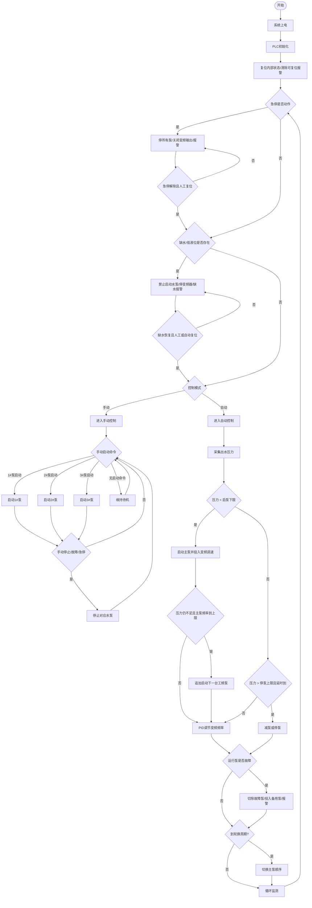

# PLC二次加压供水流程图

说明：当前环境无法直接解析 `c:\Users\15201\Desktop\plc\cd6959d5af91cd61650f5d429f68f389.mp4` 画面内容，以下流程图按二次加压供水 PLC 的常规工程控制逻辑生成，可作为绘制 CAD 流程图或 PLC 程序流程图的底稿。后续如需，我可以继续按你的视频画面逐项校核并细化点位编号。

## 工程图方框版

```text
┌──────────────┐
│    开始      │
└──────┬───────┘
       │
┌──────▼───────┐
│ 系统上电/初始化 │
└──────┬───────┘
       │
┌──────▼────────────────┐
│ 检查急停/缺水/故障状态 │
└──────┬────────────────┘
       │
   ┌───▼────┐
   │ 正常?  │
   └───┬────┘
    否 │ 是
┌──────▼───────┐
│ 停机并报警   │
└──────┬───────┘
       │
┌──────▼───────┐
│ 等待复位     │
└──────────────┘
       │
       └───────────────→ 返回检查状态

正常后进入模式判断：

┌──────────────┐
│ 手/自动选择  │
└──────┬───────┘
       │
   ┌───▼────┐
   │ 手动?  │
   └───┬────┘
    是 │ 否

手动分支：
┌──────▼────────────────┐
│ 手动启动对应水泵       │
└──────┬────────────────┘
       │
┌──────▼────────────────┐
│ 手动停止 / 故障 / 急停 │
└──────┬────────────────┘
       │
┌──────▼──────────────┐
│ 停止对应输出        │
└─────────┬──────────┘
          │
          └──→ 返回手动选择

自动分支：
┌──────▼────────────────┐
│ 采集出水压力反馈 AI01 │
└──────┬────────────────┘
       │
   ┌───▼───────────────┐
   │ 压力 < 启泵下限?  │
   └───┬───────────────┘
    是 │ 否
┌──────▼────────────────┐
│ 启动主泵/允许变频运行 │
└──────┬────────────────┘
       │
┌──────▼────────────────┐
│ 变频调速维持恒压      │
└──────┬────────────────┘
       │
┌──────▼────────────────────────┐
│ 频率到上限且压力仍不足?        │
└──────┬────────────────────────┘
       │
    是 │ 否
┌──────▼────────────────┐
│ 追加启动备用泵        │
└──────┬────────────────┘
       │
┌──────▼────────────────┐
│ 继续恒压调节          │
└──────┬────────────────┘
       │
   ┌───▼──────────────────┐
   │ 压力 > 停泵上限且延时? │
   └───┬──────────────────┘
    是 │ 否
┌──────▼────────────────┐
│ 减泵/停泵             │
└──────┬────────────────┘
       │
┌──────▼────────────────┐
│ 故障检测 / 备用切换   │
└──────┬────────────────┘
       │
┌──────▼────────────────┐
│ 轮泵判断 / 顺序切换   │
└──────┬────────────────┘
       │
       └──────────────→ 返回压力采集
```

## CAD排版版式建议

### 左栏

```text
┌──────────────┐
│ 系统上电     │
└──────┬───────┘
       │
┌──────▼───────┐
│ PLC初始化    │
└──────┬───────┘
       │
┌──────▼────────────────┐
│ 急停/缺水/故障检查    │
└──────┬────────────────┘
       │
   ┌───▼────┐
   │ 正常?  │
   └───┬────┘
```

### 中栏

```text
    否 ┌──────────────┐
──────→│ 停机并报警   │
       └──────┬───────┘
              │
       ┌──────▼───────┐
       │ 等待复位     │
       └──────┬───────┘
              │
              └──────→ 返回左栏检查

    是 ┌──────────────┐
──────→│ 手/自动选择  │
       └──────┬───────┘
              │
          ┌───▼────┐
          │ 手动?  │
          └───┬────┘
```

### 右栏

```text
    是 ┌────────────────┐
──────→│ 手动启动水泵   │
       └──────┬─────────┘
              │
       ┌──────▼─────────┐
       │ 手动停止/故障  │
       └──────┬─────────┘
              │
              └──────→ 返回手动选择

    否 ┌────────────────┐
──────→│ 采集压力反馈   │
       └──────┬─────────┘
              │
       ┌──────▼─────────┐
       │ 压力<启泵下限? │
       └──────┬─────────┘
              │
          ┌───▼──────────────┐
          │ 启动主泵+变频调速 │
          └──────┬───────────┘
                 │
          ┌──────▼───────────┐
          │ 压力满足恒压?    │
          └──────┬───────────┘
                 │
             否  │  是
          ┌──────▼───────────┐
          │ 追加备用泵        │
          └──────┬───────────┘
                 │
          ┌──────▼───────────┐
          │ 故障检测/轮泵    │
          └──────┬───────────┘
                 │
                 └────────→ 返回压力采集
```

### 出图说明

- 左栏放初始化与安全检查。
- 中栏放模式切换与故障处理。
- 右栏放自动恒压控制主逻辑。
- 流程方向建议自上而下，分支横向展开。
- 判断框统一用菱形，处理框统一用矩形，开始/结束框统一用圆角矩形。

## 主流程图



## 自动控制逻辑说明

1. 系统上电后，PLC 初始化并清除可复位状态。
2. 优先判断急停、缺水、变频器故障、水泵热继电器/过载等保护条件。
3. 自动模式下以出水压力为主控量。
4. 当压力低于启泵下限时，先启动当前主泵，并由变频器调速维持恒压。
5. 当单泵运行且变频频率已接近上限、压力仍达不到设定值时，追加下一台泵运行。
6. 当压力高于停泵上限并满足延时条件时，按先加先减或先启后停原则减泵。
7. 任一运行泵故障时，立即切除故障泵，若系统允许则自动投入备用泵。
8. 到达轮换周期后自动切换主泵，均衡各泵运行时间。

## 保护逻辑

- 急停保护：急停动作时立即停止全部泵和变频输出。
- 缺水保护：低液位或缺水信号动作时禁止启泵，并发出报警。
- 过载保护：任一水泵过载时切除该泵并报警。
- 变频器故障保护：变频器故障时退出当前调速控制，必要时停机并报警。
- 压力异常保护：压力信号断线、越上限或越下限时报警并进入安全状态。
- 手自动互锁：手动与自动模式互锁，切换模式时先释放原控制命令。

## 建议 I/O 点表

### 数字量输入 DI

- `DI01` 急停输入
- `DI02` 手/自动选择
- `DI03` 缺水/低液位输入
- `DI04` 1#泵故障
- `DI05` 2#泵故障
- `DI06` 3#泵故障
- `DI07` 变频器故障
- `DI08` 报警复位
- `DI09` 1#泵手动启动
- `DI10` 2#泵手动启动
- `DI11` 3#泵手动启动
- `DI12` 手动停止

### 模拟量输入 AI

- `AI01` 出水压力反馈
- `AI02` 变频器频率反馈

### 数字量输出 DO

- `DO01` 1#泵运行命令
- `DO02` 2#泵运行命令
- `DO03` 3#泵运行命令
- `DO04` 变频器运行允许
- `DO05` 声光报警输出

### 模拟量输出 AO

- `AO01` 变频器频率给定

## 参数建议

- `P_set` 恒压设定值
- `P_start` 启泵下限
- `P_stop` 停泵上限
- `T_stop_delay` 停泵延时
- `T_changeover` 轮换周期
- `F_max` 追加水泵判断频率上限

## 绘图建议

- 第1部分：系统上电、初始化、急停、缺水、模式选择。
- 第2部分：自动恒压、启泵、加泵、减泵、变频调速。
- 第3部分：故障切换、报警、复位、轮泵、I/O 说明。

## 备注

- 如果视频里实际是 2 泵系统，把 `3#泵` 相关节点删除即可。
- 如果视频里有“休眠/唤醒”“夜间小流量稳压”“定时轮泵”等逻辑，应补到自动控制分支中。
- 如果你要的是可直接贴进文档或渲染的版本，这份 `mermaid` 已经可以直接用。
